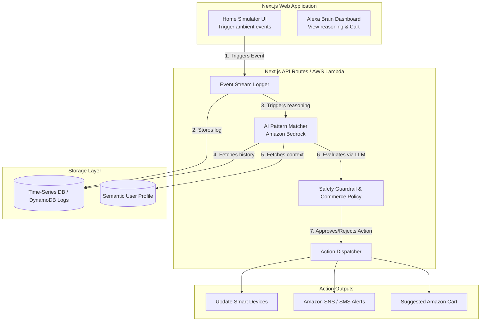

# Final Merged High-Level Design (hldv1-final)
**Project: Alexa Ambient Companion (Context-Aware Care & Commerce)**

---

## 1. Executive Summary & Judging Criteria

Modern smart home systems are largely reactive—they wait for users to issue commands. However, Indian households follow unique daily rhythms such as morning routines, medicine schedules, study hours, cooking patterns, and family care responsibilities. Additionally, many families today live across different cities, creating challenges in caring for elderly parents and staying connected.

Our solution is an ambient, privacy-first AI companion that learns household patterns, detects contextual events, and proactively assists residents and family members. By leveraging Amazon Bedrock for intelligent reasoning, the system transforms simple household signals into meaningful actions such as routine automation suggestions, health check reminders, safety alerts, and contextual shopping recommendations.

### What the Amazon Team is Expecting (Judging Criteria)
Based on the problem statement briefing, the Amazon engineering team has explicitly asked us to "work backwards from the customer" and address the following core pillars:
1. **Customer Obsession:** Identify a real, repetitive problem in Indian households and show how AI makes life easier.
2. **Execution without Hardware:** They expect a mobile/web application or a **simulator interface** that demonstrates how the AI reasons and acts. We do not need real Alexa devices.
3. **Scale:** The architecture must theoretically support millions of homes without breaking.
4. **Privacy & Trust:** The system must ensure user privacy (e.g., local audio processing).
5. **Safety (UX Protection):** We must have a mechanism to prevent incorrect automations from creating a bad customer experience.
6. **Future Vision:** We must explain how this scales to the "next level" with Amazon's full resources.

---

## 2. Technical Stack & AWS Scale Architecture

To ensure rapid execution in 48 hours while proving we understand enterprise scale, we will use a serverless architecture.

### Hackathon Architecture (48-Hour Execution)
*   **Frontend Simulator:** Next.js (React) + Tailwind CSS. Provides a stunning, premium interactive dashboard representing the home floorplan. (Moving away from Streamlit to ensure a consumer-grade UI).
*   **Backend API Layer:** Next.js API Routes. Deploys seamlessly as serverless functions.
*   **Database:** Amazon DynamoDB (or Supabase/Local mock). Used for high-speed logging and profile storage.
*   **AI Engine:** Amazon Bedrock (Claude 3.5 Sonnet / Titan) or Gemini API via SDK.
*   **Notifications:** Amazon SNS for pushing text alerts.

### The "Amazon Scale" Production Architecture
If an Amazon SDE team were building this to handle millions of Indian households, the architecture expands to:
1. **Device Ingestion:** Millions of devices connect via **AWS IoT Core** (MQTT). Data is piped into **Amazon Kinesis Data Streams** to handle massive real-time load without crashing the backend.
2. **The Storage Layer:**
   *   **Amazon ElastiCache (Redis):** Short-term memory for the *current state* of the house (e.g., "Motor is running").
   *   **Amazon Timestream:** Time-Series DB logging all historical events chronologically.
   *   **Amazon OpenSearch (Vector DB):** Long-term semantic memory storing learned unstructured user habits.
3. **The Intelligence Layer:**
   *   **Real-time Processor:** AWS Lambda triggers **Amazon Bedrock (LLM)** for immediate anomalies.
   *   **Pattern Discovery:** **Amazon SageMaker** runs batch ML jobs overnight to mine Timestream data for new repeating routines.

---

## 3. Entry Points for Information Feeding (Data Streams)

For the AI to truly understand the context of an Indian household, it needs diverse streams of data. We process these into structured events before sending them to the LLM.

1. **Acoustic Awareness (The "Ears"):** Microphones running localized, lightweight audio-classification models (TinyML).
   *   *Example:* `"event": "sound_detected", "type": "pressure_cooker_whistle", "count": 3`
2. **IoT & Appliance States (The "Nervous System"):** Smart plugs and appliances reporting their power usage and state.
   *   *Example:* `"event": "device_state_change", "device": "water_motor", "state": "ON"`
3. **Environmental & External Context (The "Awareness"):** Weather APIs, Home Temperature sensors, Calendar/Clock, and Power Grid monitors.
   *   *Example:* `"context": "power_status", "state": "power_cut_detected"`
4. **User Interventions & Feedback (The "Teacher"):** Manual button presses or voice corrections that serve as immediate feedback.

---

## 4. Core Use Cases & Scenario Mapping

We merge practical smart home automation with emotional care and high-value contextual commerce.

| Use Case | Context Trigger | Bedrock Reasoning | Proactive Action |
|-----------|-----------------|-------------------|------------------|
| **Routine Learning** | Geyser enabled at 7 AM daily | Identifies recurring morning pattern | Suggest automatic scheduling |
| **Study Hour Detection** | TV muted every evening | Detects quiet/study routine | Suggest focus mode automation |
| **Contextual Shopping** | Baby crying event or spoken request | Maps context to likely consumables | Add items to **Approval Cart** |
| **Elderly Care** | Increasing TV volume trend | Detects possible hearing deterioration | **Notify family member via SNS** |
| **Long-Distance Care** | Medicine-related conversation markers | Identifies potential vulnerability | Suggest check-in call |
| **Kitchen Safety** | Excessive cooker whistle count | Detects unusual cooking duration | **Immediate safety alert & stove shutoff** |
| **Working Couple** | High meeting density from calendar | Predicts elevated stress levels | Suggest wellness reminder |

---

## 5. LLM Context Window vs Training (Data Model)

We are **not** going to train or fine-tune the actual weights of the LLM model. Training is too slow and expensive to scale to millions of homes. Instead, we use a dynamic Context Window (RAG).

1. **Time-Series Data (The "What and When"):** This is a continuous stream of events (e.g., `07:00 AM: Motor ON`, `07:15 AM: Motor OFF`). LLMs don't need a Vector DB for this; they need a chronological list. For this, we use a **Time-Series Database** (or DynamoDB with a timestamp sort key).
2. **Semantic Memory (The "Why and How"):** This is unstructured context like *"The user hates loud noises in the evening"* or *"Guest usually prefer Chai over Coffee"*. **This is where the Vector DB shines.** By embedding these preferences as vectors, the LLM can instantly retrieve relevant context when an event happens, without needing to re-read months of event logs.

**The JSON Payload Example sent to Bedrock:**
```json
{
  "timestamp": "2026-06-13T19:30:00",
  "trigger_event": {
    "type": "audio",
    "classification": "pressure_cooker_whistle",
    "occurrences": 3
  },
  "home_context": {
    "active_appliances": ["kitchen_exhaust_fan", "living_room_tv"],
    "environment": {
       "time_of_day": "Evening"
    }
  }
}
```
By managing the **state** and **context** outside the LLM, and just using the LLM as a "reasoning engine," you make the system endlessly scalable and completely private to each household.

---

## 6. Privacy, Ethics & Critical Safeguards

To make this a truly "Amazon-grade" product pitch, the architecture includes strict guardrails to ensure trust.

### 1. Edge-First Processing (Privacy-by-Design)
Raw audio is never permanently stored or sent to the cloud. Local Voice Activity Detection (VAD) and TinyML acoustic classification run on-device. The raw audio is discarded, and only abstract event tokens (e.g., `{"event": "pressure_cooker_whistle", "count": 6}`) are transmitted.

### 2. The Safety Guardrail Layer (Policy Engine)
LLMs can hallucinate. You absolutely *cannot* let an AI directly control a house without restrictions. We place a **Deterministic Policy Engine** between the LLM output and the Action Dispatcher.
*   *Example Rule:* "Never turn ON a heat-generating appliance proactively without explicit voice confirmation."
If the LLM suggests violating a rule, the system blocks it and sends a notification instead.

### 3. Context-Aware Commerce Flow (No Automatic Purchases)
The AI **never places orders independently.**
1. Context is detected (Baby crying).
2. Recommendations are generated (Diapers).
3. Items are placed into a "Suggested Cart".
4. User explicitly approves checkout.

### 4. The Negative Feedback Loop
If our AI decides to lower the TV volume because it's 8:00 PM (Study Time), but the user immediately grabs the remote and turns the volume back up, the system captures this "override event". It is routed directly back into the Context Database so the AI unlearns the bad habit instantly.

---

## 7. High-Level Design (System Flow Diagram)



---

## 8. 48-Hour Execution Plan & Demo Scenarios

### Phase 1: Core Infrastructure & Data Flow (Hours 0–12)
- Initialize Next.js repository with Tailwind CSS.
- Set up API routes to act as the Event Bus.
- Create database tables (DynamoDB or Supabase) for Household Logs, Suggested Cart Items, and User Profiles.

### Phase 2: AI Reasoning Engine (Hours 12–24)
- Integrate Amazon Bedrock API (or Gemini).
- Design prompts for context understanding, household anomaly detection, and commerce recommendations.
- Validate LLM responses and convert outputs into structured JSON actions.

### Phase 3: Proactive Action Layer (Hours 24–36)
- Build the Suggested Cart workflow.
- Implement the Safety Policy Engine and Negative Feedback loop logic.
- Integrate alert generation (simulated SNS) for elderly care and safety events.

### Phase 4: Experience & Demo Readiness (Hours 36–48)
- Develop the premium UI dashboard.
- Add event simulation controls (Baby crying, Pressure cooker whistle).
- Test complete end-to-end flows.

### The Winning Demo Scenarios
1. **Contextual Commerce:** User triggers a baby crying event → Bedrock recommends baby essentials → Suggested Cart appears for approval.
2. **Elderly Care:** Historical TV volume logs are analyzed → Bedrock detects increasing trend → Family member receives a wellness text notification.
3. **Kitchen Safety & Feedback:** Cooker whistle events trigger the Safety Engine to turn off the stove. The user overrides an action to demonstrate the AI unlearning a behavior in real-time.
