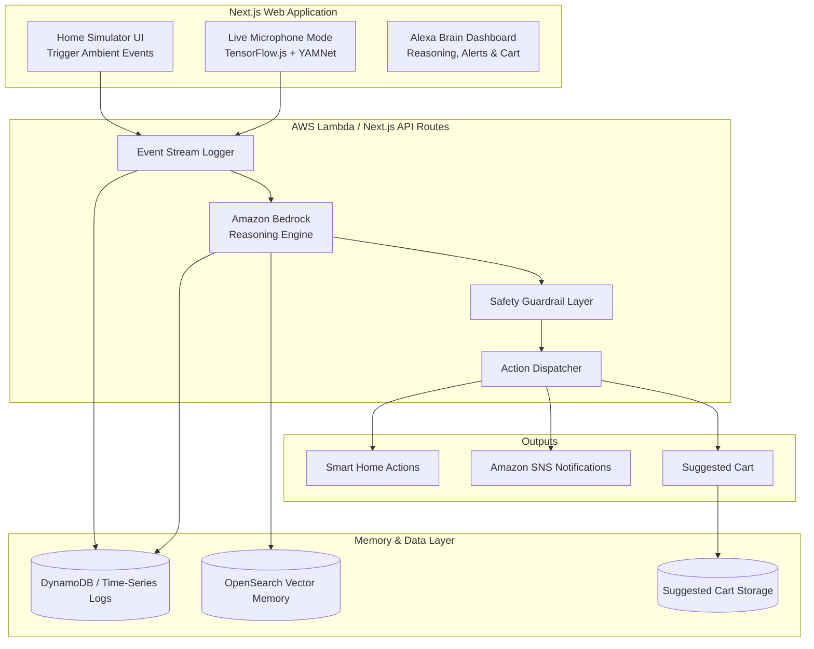

# Alexa Ambient Companion
## Context-Aware Care, Safety & Commerce for Indian Households

---

# 1. Executive Summary & Judging Criteria

Modern smart home systems are largely reactive—they wait for users to issue commands. However, Indian households follow unique daily rhythms such as morning routines, medicine schedules, study hours, cooking patterns, and family care responsibilities. Additionally, many families today live across different cities, creating challenges in caring for elderly parents and staying connected.

Our solution is an ambient, privacy-first AI companion that learns household patterns, detects contextual events, and proactively assists residents and family members. By leveraging Amazon Bedrock for intelligent reasoning, the system transforms simple household signals into meaningful actions such as routine automation suggestions, health check reminders, safety alerts, and contextual shopping recommendations.

Unlike traditional smart assistants that react only after receiving commands, Alexa Ambient Companion continuously understands household context while preserving privacy and user control.

### What the Amazon Team is Expecting (Judging Criteria)

Based on the problem statement briefing, the Amazon engineering team has explicitly asked us to "work backwards from the customer" and address the following core pillars:

1. **Customer Obsession**
   - Identify a real, repetitive problem in Indian households.
   - Show measurable value creation.

2. **Execution without Hardware**
   - Demonstrate the experience through a web/mobile simulator.
   - No physical Alexa device required.

3. **Scale**
   - Architecture should theoretically support millions of households.

4. **Privacy & Trust**
   - Audio and household data must be protected.

5. **Safety**
   - AI should not be allowed to make dangerous decisions autonomously.

6. **Future Vision**
   - Demonstrate how the solution evolves with Amazon-scale infrastructure.

---

# 2. Technical Stack & AWS Scale Architecture

## Hackathon Architecture (48-Hour Execution)

### Frontend
- Next.js
- React
- Tailwind CSS

Provides:
- Interactive household dashboard
- Event simulator
- Suggested Cart
- Family Care Dashboard
- Live microphone mode

### Backend

- Next.js API Routes
- AWS Lambda

Responsibilities:
- Event ingestion
- Bedrock orchestration
- Recommendation generation
- Pattern analysis

### Database

- Amazon DynamoDB
- (Supabase/local mock during development)

Stores:
- Household logs
- User profiles
- Suggested cart items
- Behavioral history

### AI Engine

- Amazon Bedrock
- Claude / Titan Models

Responsibilities:
- Pattern reasoning
- Context understanding
- Commerce recommendations
- Elderly care analysis
- Safety evaluations

### Notifications

- Amazon SNS

Used for:
- Wellness notifications
- Family alerts
- Safety warnings

---

## Production-Scale Amazon Architecture

### Device Ingestion Layer

Millions of household devices connect via:

- AWS IoT Core
- MQTT Protocol

Data flows into:

- Amazon Kinesis Data Streams

for large-scale event processing.

---

### Storage Layer

#### Amazon ElastiCache (Redis)

Short-term state memory.

Examples:

- Water motor currently ON
- TV volume currently 32
- Kitchen occupied

---

#### Amazon Timestream

Stores chronological household history.

Examples:

- Appliance usage
- Activity timelines
- Environmental readings

---

#### Amazon OpenSearch (Vector Memory)

Stores semantic household preferences.

Examples:

- User dislikes loud alerts at night
- Parents prefer morning reminders
- Guest preference patterns

---

### Intelligence Layer

#### Real-Time Processor

AWS Lambda invokes Bedrock when events occur.

Examples:

- Baby crying
- Cooker whistle
- Missed medicine

---

#### Pattern Discovery Engine

Amazon SageMaker analyzes:

- Weekly routines
- Long-term behavior
- Anomaly detection

to discover new household habits automatically.

---

# 3. Entry Points for Information Feeding (Data Streams)

For the AI to understand a household, it needs multiple streams of context.

---

## 1. Acoustic Awareness (The Ears)

Microphones running lightweight acoustic detection models.

Example:

```json
{
  "event": "sound_detected",
  "type": "pressure_cooker_whistle",
  "count": 3
}
```

---

## 2. IoT & Appliance States (The Nervous System)

Smart devices provide status updates.

Example:

```json
{
  "event": "device_state_change",
  "device": "water_motor",
  "state": "ON"
}
```

---

## 3. Environmental Context (The Awareness Layer)

Sources:

- Weather APIs
- Home temperature sensors
- Power grid information
- Calendar schedules

Example:

```json
{
  "context": "power_status",
  "state": "power_cut_detected"
}
```

---

## 4. User Feedback (The Teacher)

User actions provide corrections.

Examples:

- Reject recommendation
- Override automation
- Dismiss alert

These become feedback signals.

---

## 5. Real-Time Acoustic Event Detection (Demo & Production Path)

To demonstrate ambient intelligence without dedicated hardware, the platform supports browser-based microphone listening.

### Primary Approach: TensorFlow.js + YAMNet (Edge AI)

A pre-trained YAMNet acoustic classification model runs directly in the Next.js frontend.

Benefits:

- Detects 500+ sounds
- Whistle detection
- Baby crying detection
- Alarm recognition
- Siren recognition
- Edge processing
- No audio storage

Example Output:

```json
{
  "event": "sound_detected",
  "type": "pressure_cooker_whistle",
  "confidence": 0.96,
  "timestamp": "2026-06-13T19:30:00"
}
```

### Fallback Approach: Amazon Bedrock Audio Understanding

If confidence is low:

1. Short audio clip recorded
2. Sent to Bedrock
3. Bedrock classifies audio
4. Structured event returned

This creates a hybrid architecture balancing:

- Privacy
- Reliability
- Scalability
- Demo robustness

# 4. Core Use Cases & Scenario Mapping

We merge practical smart-home automation with emotional care, safety, and contextual commerce.

| Use Case | Context Trigger | Bedrock Reasoning | Proactive Action |
|-----------|-----------------|-------------------|------------------|
| Routine Learning | Geyser enabled every morning at 7 AM | Detects recurring habit | Suggest automatic scheduling |
| Study Hour Detection | TV muted every evening | Detects study pattern | Suggest Focus Mode |
| Contextual Shopping | Baby crying or household request | Maps situation to consumables | Add items to Suggested Cart |
| Elderly Care | Increasing TV volume trend | Possible hearing decline | Notify family member |
| Long-Distance Care | Medicine-related discussions | Detects vulnerability | Suggest check-in call |
| Kitchen Safety | Excessive whistle count | Cooking anomaly detected | Safety alert |
| Working Couple Support | Dense calendar schedule | Predicts stress | Wellness recommendation |

---

## Example Scenario 1: Contextual Commerce

### Situation

A parent mentions:

> "We're running low on baby supplies."

### System Flow

1. Voice input captured.
2. Event sent to Bedrock.
3. Bedrock infers household need.
4. Product recommendations generated.
5. Suggested Cart appears.
6. User approves purchase.

### Result

Convenience without sacrificing control.

---

## Example Scenario 2: Elderly Care

### Situation

TV volume gradually increases over several weeks.

### System Flow

1. Historical logs analyzed.
2. Pattern detected.
3. Bedrock identifies possible hearing issue.
4. Family notification generated.

### Result

Proactive care without invasive monitoring.

---

## Example Scenario 3: Kitchen Safety

### Situation

Multiple pressure cooker whistles occur.

### System Flow

1. Whistles detected.
2. Event history analyzed.
3. Cooking duration appears abnormal.
4. Safety warning generated.

### Result

Potential accident prevented.

---

# 5. LLM Context Window vs Training (Data Model)

We are NOT training or fine-tuning the LLM.

Instead, we provide contextual household information dynamically using retrieval and structured memory.

---

## Why Not Fine-Tune?

Fine-tuning:

- Expensive
- Slow
- Difficult to personalize

Each home behaves differently.

Therefore:

- Household intelligence lives outside the model.
- Bedrock acts purely as a reasoning engine.

---

## Time-Series Memory (The What & When)

Stores chronological events.

Examples:

```text
07:00 AM → Water Motor ON
07:15 AM → Water Motor OFF
07:30 AM → Geyser ON
08:00 AM → TV OFF
```

Stored in:

- DynamoDB
- Amazon Timestream

Purpose:

Provide historical context.

---

## Semantic Memory (The Why)

Stores preferences and behavioral information.

Examples:

```text
User dislikes loud alerts after 10 PM.
Parents prefer medicine reminders in the morning.
Guest usually prefers tea over coffee.
```

Stored in:

- OpenSearch Vector Store

Purpose:

Retrieve personalized context instantly.

---

## Example Bedrock Payload

```json
{
  "timestamp": "2026-06-13T19:30:00",
  "trigger_event": {
    "type": "audio",
    "classification": "pressure_cooker_whistle",
    "occurrences": 3
  },
  "home_context": {
    "active_appliances": [
      "kitchen_exhaust_fan",
      "living_room_tv"
    ],
    "environment": {
      "time_of_day": "Evening"
    }
  }
}
```

### Why This Scales

Instead of retraining millions of household models:

- Store context externally.
- Retrieve only relevant information.
- Let Bedrock reason over current context.

This creates massive scalability.

---

# 6. Privacy, Ethics & Critical Safeguards

Amazon places enormous emphasis on trust.

Our design intentionally incorporates multiple protection layers.

---

## 1. Edge-First Processing (Privacy-by-Design)

Raw audio is never permanently stored.

Processing happens locally using:

- TensorFlow.js
- YAMNet

Only event tokens are transmitted.

Example:

```json
{
  "event": "pressure_cooker_whistle",
  "count": 6
}
```

Raw audio is immediately discarded.

---

## 2. Safety Guardrail Layer (Policy Engine)

LLMs can hallucinate.

Therefore:

Bedrock recommendations never directly control household actions.

A deterministic policy layer sits between:

```text
Bedrock
   ↓
Policy Engine
   ↓
Action Dispatcher
```

### Example Rule

```text
Never turn ON a heat-generating appliance
without explicit user confirmation.
```

---

## 3. Context-Aware Commerce Policy

The AI never places orders automatically.

Flow:

```text
Context Detected
      ↓
Recommendation Generated
      ↓
Suggested Cart Created
      ↓
User Approval Required
```

This guarantees user control.

---

## 4. Negative Feedback Learning Loop

If:

- AI lowers TV volume
- User immediately increases it

then:

```text
Override Event
       ↓
Feedback Database
       ↓
Preference Update
```

The AI learns from mistakes.

---

## 5. Privacy-First Audio Processing

Microphone listening follows strict privacy rules.

### Principles

1. Local audio processing
2. No cloud audio storage
3. No continuous recording
4. Event-only transmission
5. User-controlled activation

### Judge Narrative

> Notice how quickly the system reacts. That's because raw audio never leaves the device. The browser performs sound recognition locally and only transmits structured household events.

This directly aligns with Amazon's Privacy & Trust pillar.

---

# Trigger Flow 1: Contextual Commerce

This demonstrates how ambient understanding creates customer value while preserving user control.

```text
User presses Voice Button
or Event Simulation Button
        ↓
Frontend
        ↓
Amazon API Gateway
        ↓
AWS Lambda
        ↓
Amazon Bedrock
(Intent Understanding)
        ↓
Product Recommendation
        ↓
DynamoDB
(Store Recommendation)
        ↓
Suggested Cart
        ↓
User Approval
```

### Detailed Flow

1. User presses voice button.
2. Frontend creates structured event.
3. Event sent through API Gateway.
4. Lambda invokes Bedrock.
5. Bedrock recommends products.
6. Recommendations stored in DynamoDB.
7. Suggested Cart displayed.
8. User approves checkout.

---

# Trigger Flow 2: Multi-Day Pattern Analysis

This demonstrates proactive intelligence.

```text
Daily Household Logs
        ↓
DynamoDB
        ↓
AWS Lambda
        ↓
Retrieve Last 3–7 Days
        ↓
Amazon Bedrock
(Pattern Analysis)
        ↓
Routine / Anomaly Detection
        ↓
Amazon SNS
        ↓
Alert or Recommendation
```

### Detailed Flow

1. Daily logs stored.
2. Lambda retrieves recent history.
3. Bedrock analyzes trends.
4. Routine or anomaly identified.
5. Recommendation generated.
6. SNS notification delivered.

### Example Discoveries

- Increasing TV volume.
- Missed medicine routine.
- Long-running water motor.
- Consistent study schedule.
- Unusual kitchen activity.

These insights transform Alexa from reactive assistant to proactive household companion.
# 7. High-Level Design (System Flow Diagram)



---

# End-to-End System Flow

```text
Household Event
        ↓
Event Stream Logger
        ↓
DynamoDB Storage
        ↓
Amazon Bedrock
        ↓
Context Retrieval
        ↓
Reasoning Output
        ↓
Policy Validation
        ↓
Action Dispatcher
        ↓
Alert / Suggested Cart / Automation
```

---

# Live Audio Intelligence Architecture

One of the strongest aspects of the demo is that it can respond to real sounds in real time.

## Why Real-Time Audio Matters

Most hackathon projects use buttons.

We demonstrate actual ambient intelligence.

Examples:

- Pressure cooker whistle
- Baby crying
- Alarm sound
- Distress sound

---

## Edge AI Architecture

```text
Laptop Microphone
        ↓
TensorFlow.js
        ↓
YAMNet
        ↓
Sound Classification
        ↓
Structured Event
        ↓
Amazon Bedrock
        ↓
Reasoning
        ↓
Dashboard Update
```

---

## Example Live Event

```json
{
  "event": "sound_detected",
  "type": "pressure_cooker_whistle",
  "confidence": 0.96
}
```

---

## Why Judges Will Like This

Traditional approach:

```text
Button Press
      ↓
Alert
```

Our approach:

```text
Real Household Sound
      ↓
Edge AI Detection
      ↓
Context Understanding
      ↓
Bedrock Reasoning
      ↓
Action Recommendation
```

This feels much closer to a future Alexa experience.

---

## Bedrock Audio Fallback

If YAMNet confidence is low:

```text
Audio Clip
      ↓
Amazon Bedrock
      ↓
Audio Understanding
      ↓
Event Classification
```

This guarantees robustness.

---

# 8. 48-Hour Execution Plan

---

## Phase 1: Core Infrastructure (Hours 0–12)

### Tasks

- Initialize Next.js project
- Configure Tailwind CSS
- Build dashboard shell
- Create DynamoDB schema
- Build Event Bus APIs
- Set up Lambda handlers

### Deliverable

Basic event ingestion working.

---

## Phase 2: Bedrock Integration (Hours 12–24)

### Tasks

- Connect Amazon Bedrock
- Design reasoning prompts
- Create structured outputs
- Build recommendation engine
- Build anomaly detection prompts

### Deliverable

AI reasoning operational.

---

## Phase 3: Action Layer (Hours 24–36)

### Tasks

- Suggested Cart workflow
- SNS notifications
- Elderly care alerts
- Safety policy engine
- Feedback learning loop

### Deliverable

End-to-end intelligence flow operational.

---

## Phase 4: Experience & Demo Readiness (Hours 36–48)

### Tasks

- Premium UI polishing
- TensorFlow.js integration
- YAMNet integration
- Live microphone mode
- Event simulation controls
- Testing
- Demo preparation

### Deliverable

Judge-ready product demonstration.

---

# The Winning Demo Experience

---

## Demo Mode 1: Real-Time Ambient Intelligence

### Live Microphone Toggle

A dedicated dashboard switch enables real-time listening.

When enabled:

```text
Real Whistle
(or phone playing whistle sound)
        ↓
Browser Microphone
        ↓
TensorFlow.js
        ↓
YAMNet
        ↓
Sound Detection
        ↓
Bedrock
        ↓
Reasoning
        ↓
Dashboard Response
```

### Judge Narrative

> We are not simulating intelligence. The browser is actively listening, classifying household sounds locally, and sending structured context to Bedrock for reasoning in real time.

### Why It Impresses

- Edge AI
- Privacy-first architecture
- Real ambient intelligence
- No hardware dependency
- Immediate visual feedback

---

## Demo Mode 2: Contextual Commerce

### Scenario

User says:

> "We're running low on baby supplies."

### Flow

```text
Voice Input
        ↓
Bedrock Intent Analysis
        ↓
Product Recommendation
        ↓
Suggested Cart
        ↓
User Approval
```

### Example Cart

- Diapers
- Baby Wipes
- Formula

No automatic purchases occur.

---

## Demo Mode 3: Elderly Care

### Scenario

Historical TV volume trends show gradual increase.

### Flow

```text
Historical Logs
        ↓
Bedrock Analysis
        ↓
Potential Hearing Concern
        ↓
SNS Notification
        ↓
Family Member Alert
```

### Outcome

Proactive long-distance family care.

---

## Demo Mode 4: Kitchen Safety

### Scenario

Repeated pressure cooker whistle events.

### Flow

```text
Whistle Events
        ↓
Bedrock
        ↓
Kitchen Safety Analysis
        ↓
Policy Validation
        ↓
Safety Alert
```

### Outcome

Potential household risk identified early.

---

## Demo Mode 5: Multi-Day Pattern Analysis

### Scenario

Several days of household data exist.

### Flow

```text
7 Days of Logs
        ↓
DynamoDB
        ↓
AWS Lambda
        ↓
Amazon Bedrock
        ↓
Pattern Discovery
        ↓
Routine Recommendation
```

### Example Insights

- Daily study routine discovered
- Consistent water usage anomaly
- Missed medicine schedule
- TV volume increase trend

---

# Demo Reliability Strategy (Hackathon Safety Net)

A hackathon demo should never depend on a single trigger path.

Therefore we implement two independent systems.

---

## A. Live Microphone Mode

### Purpose

Real-time ambient intelligence.

### Benefits

- Edge AI demonstration
- Maximum judge impact
- Real-world behavior

---

## B. Simulator Mode

Manual trigger buttons remain available.

### Available Triggers

- Baby Crying
- Pressure Cooker Whistle
- Medicine Reminder Missed
- Water Motor Running
- Elderly Care Alert
- Study Hour Trigger

### Why Keep Simulator Mode?

If:

- Wi-Fi fails
- Microphone permission issues occur
- Background noise becomes excessive
- Hardware behaves unpredictably

the demo still succeeds.

---

## Judge Narrative

> Since hackathon environments are noisy and unpredictable, we support both real ambient event detection and simulator-generated events. The intelligence layer remains exactly the same in both cases.

This guarantees a flawless demonstration.

---

# Future Vision

With Amazon-scale resources, Alexa Ambient Companion can evolve into:

### Household Digital Twin

A continuously updated understanding of:

- Family routines
- Appliance behavior
- Safety patterns
- Care requirements

---

### Hyper-Personalized Commerce

Context-aware shopping recommendations based on:

- Consumption patterns
- Family size
- Seasonal changes
- Household events

---

### Elderly & Family Care Network

Cross-city support system for:

- Aging parents
- Wellness monitoring
- Medication adherence
- Emergency escalation

---

### Predictive Home Intelligence

Predict before problems occur:

- Appliance failures
- Water wastage
- Safety risks
- Missed routines

---

# Final Closing Statement

Alexa Ambient Companion transforms smart homes from reactive systems into proactive, privacy-first household companions.

By combining:

- Amazon Bedrock
- DynamoDB
- SNS
- Edge AI (TensorFlow.js + YAMNet)
- Context-Aware Commerce
- Multi-Day Pattern Analysis
- Safety Guardrails
- Human Approval Workflows

we create an experience that is:

- Customer Obsessed
- Privacy First
- Responsible
- Scalable
- Commercially Valuable
- Technically Feasible

Most importantly, it demonstrates a compelling vision of how Alexa can become a trusted ambient companion for millions of Indian households.