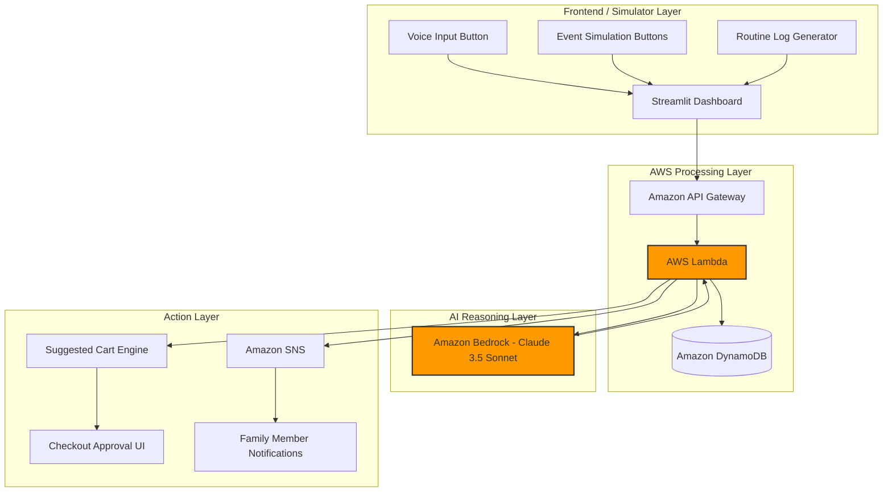

# HLD: Context-Aware Ambient Care for Indian Households

## 1. Executive Summary

Modern smart home systems are largely reactive—they wait for users to issue commands. However, Indian households follow unique daily rhythms such as morning routines, medicine schedules, study hours, cooking patterns, and family care responsibilities. Additionally, many families today live across different cities, creating challenges in caring for elderly parents and staying connected.

Our solution is an ambient, privacy-first AI companion that learns household patterns, detects contextual events, and proactively assists residents and family members. By leveraging Amazon Bedrock for intelligent reasoning, the system transforms simple household signals into meaningful actions such as routine automation suggestions, health check reminders, safety alerts, and contextual shopping recommendations.

---

## 2. System Architecture & Feasibility Flow



### Trigger Flow 1: Contextual Commerce

1. User presses a voice button or event simulation button.
2. Frontend sends a structured event to Amazon API Gateway.
3. AWS Lambda invokes Amazon Bedrock for intent understanding.
4. Bedrock recommends relevant household items.
5. Lambda stores recommendations in DynamoDB.
6. Frontend displays a "Suggested Cart" requiring explicit user approval.

### Trigger Flow 2: Multi-Day Pattern Analysis

1. Daily routine logs are stored in DynamoDB.
2. Lambda retrieves 3–7 days of household activity.
3. Amazon Bedrock analyzes behavioral trends.
4. Potential anomalies or routines are detected.
5. Amazon SNS sends alerts or automation suggestions.

---

## 3. Core Use Cases & Scenario Mapping

| Use Case | Context Trigger | Bedrock Reasoning | Proactive Action |
|-----------|-----------------|-------------------|------------------|
| Routine Learning | Geyser enabled at 7 AM daily | Identifies recurring morning pattern | Suggest automatic scheduling |
| Study Hour Detection | TV muted every evening | Detects quiet/study routine | Suggest focus mode automation |
| Contextual Shopping | Baby crying event or spoken grocery request | Maps context to likely consumables | Add items to approval cart |
| Elderly Care | Increasing TV volume trend | Detects possible hearing deterioration | Notify family member |
| Long-Distance Family Care | Medicine-related conversation markers | Identifies potential vulnerability | Suggest check-in call |
| Kitchen Safety | Excessive cooker whistle count | Detects unusual cooking duration | Immediate safety alert |
| Working Couple Support | High meeting density from calendar | Predicts elevated stress levels | Suggest wellness reminder |

---

## 4. Audio Processing Workflow

### Hackathon Prototype

To ensure rapid implementation within 48 hours:

#### Voice Intent Flow

1. User records a short voice note.
2. Audio is uploaded to AWS Lambda.
3. Speech-to-text converts audio into text.
4. Text is sent to Amazon Bedrock.
5. Bedrock extracts intent and recommends actions.

#### Ambient Event Flow

Environmental events are simulated using dashboard buttons:

- Baby Crying
- Pressure Cooker Whistle
- Medicine Mention
- Grocery Reminder

Each button sends a structured event directly to the backend, eliminating the need for continuous audio processing during the prototype phase.

---

### Future Production Architecture

#### Edge Processing Pipeline

1. Local Voice Activity Detection (VAD) activates only when needed.
2. TinyML acoustic classification runs on-device.
3. Raw audio is immediately discarded.
4. Only high-level event tokens are transmitted.

Example:

```json
{
  "event": "pressure_cooker_whistle",
  "count": 6
}
```

This minimizes bandwidth usage and maximizes privacy.

---

## 5. Technical Stack

| Layer | Technology |
|---------|------------|
| Frontend Simulator | Streamlit (Python) |
| API Layer | Amazon API Gateway |
| Compute | AWS Lambda (Python) |
| Database | Amazon DynamoDB |
| AI Engine | Amazon Bedrock (Claude 3.5 Sonnet) |
| Notifications | Amazon SNS |
| SDK | Boto3 |

---

## 6. Context-Aware Commerce Flow

The system introduces frictionless yet safe contextual shopping.

### Safety Principle: No Automatic Purchases

The AI never places orders independently.

Instead:

1. Context is detected.
2. Recommendations are generated.
3. Items are placed into a Suggested Cart.
4. User explicitly approves checkout.

Example:

```json
{
  "intent": "COMMERCE_SUGGESTION",
  "trigger": "baby_crying_10m",
  "recommended_items": [
    {
      "name": "Baby Diapers",
      "qty": 1
    },
    {
      "name": "Baby Wipes",
      "qty": 2
    }
  ]
}
```

---

## 7. Privacy & Ethics

### Privacy-by-Design Principles

#### Edge-First Processing
Raw audio is never permanently stored.

#### Tokenized Events
Only abstract household events are transmitted.

Example:

```json
{
  "category": "health_intent",
  "severity": "low"
}
```

#### Consent-Driven Sharing
Residents control what information is shared with family members.

#### Human-in-the-Loop Actions
Every automation suggestion and shopping recommendation requires user approval.

---

## 8. 48-Hour Execution Plan

### Phase 1: Core Infrastructure & Data Flow (Hours 0–12)

- Set up Amazon API Gateway endpoints.
- Create DynamoDB tables for:
  - Household Logs
  - Suggested Cart Items
  - User Profiles
  - Routine Suggestions
- Configure AWS Lambda functions.
- Create mock event generators and routine log datasets.

### Phase 2: AI Reasoning Engine (Hours 12–24)

- Integrate Amazon Bedrock using Boto3.
- Design prompts for:
  - Routine learning
  - Context understanding
  - Household anomaly detection
  - Commerce recommendations
- Validate Bedrock responses and convert outputs into structured JSON actions.

### Phase 3: Proactive Action Layer (Hours 24–36)

- Build the Suggested Cart workflow.
- Integrate Amazon SNS notifications.
- Implement alert generation for:
  - Elderly care
  - Safety events
  - Routine suggestions
  - Family check-in recommendations
- Connect DynamoDB outputs with user-facing actions.

### Phase 4: Experience & Demo Readiness (Hours 36–48)

- Develop the Streamlit dashboard.
- Add event simulation controls:
  - Baby crying
  - Pressure cooker whistle
  - Medicine request
  - Grocery reminder
- Build Suggested Cart approval interface.
- Test complete end-to-end flows.
- Prepare presentation and live demonstration scenarios.

### Demo Scenarios

#### Scenario 1: Contextual Commerce
User triggers a baby crying event → Bedrock recommends baby essentials → Suggested Cart appears for approval.

#### Scenario 2: Elderly Care
Historical TV volume logs are analyzed → Bedrock detects increasing trend → Family member receives a wellness notification.

#### Scenario 3: Kitchen Safety
Multiple cooker whistle events are triggered → Safety threshold exceeded → Instant alert is generated.

#### Scenario 4: Routine Learning
Repeated geyser usage logs are analyzed → Bedrock identifies a pattern → Automation suggestion is presented.

---

## 9. Future Production Scope

### Smart Hardware Integration

Replace simulator buttons with:

- ESP32
- Raspberry Pi
- TinyML acoustic models
- On-device event classification

### Federated Learning

Enable routine learning directly on edge devices so behavioral data never leaves the home.

### Smart Home Integration

Connect with:

- Smart switches
- Geysers
- TVs
- Lights
- Home appliances

### Advanced Family Care

- Elderly wellness monitoring
- Personalized medication reminders
- Long-distance family engagement recommendations

---

## Key Innovation

Rather than building another smart home assistant that waits for commands, this solution creates a proactive, context-aware household companion that understands routines, detects meaningful changes, safeguards family members, and enables thoughtful actions while maintaining strict privacy and user control.