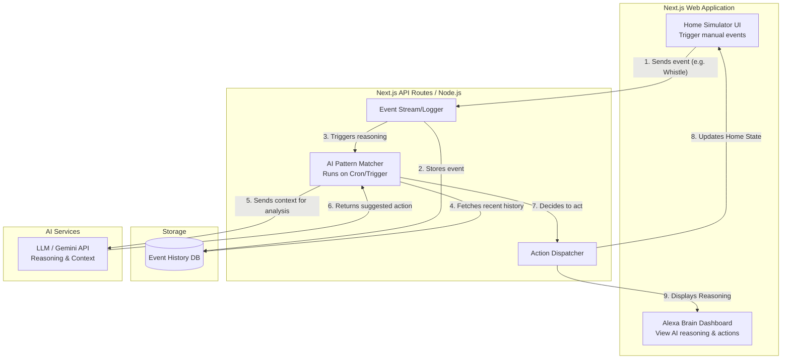

# 1. What the Amazon Team is Expecting (Judging Criteria)

Based on the problem statement briefing, the Amazon engineering team has explicitly asked us to "work backwards from the customer" and address the following core pillars:

1. **Customer Obsession:** Identify a real, repetitive problem in Indian households and show how AI makes life easier.
2. **Execution without Hardware:** They expect a mobile/web application or a **simulator interface** that demonstrates how the AI reasons and acts. We do not need real Alexa devices.
3. **Scale:** The architecture must theoretically support millions of homes without breaking.
4. **Privacy & Trust:** The system must ensure user privacy (e.g., local audio processing).
5. **Safety (UX Protection):** We must have a mechanism to prevent incorrect automations from creating a bad customer experience.
6. **Future Vision:** We must explain how this scales to the "next level" with Amazon's full resources.

---

# 2. Scope, Tools, and High-Level Design (HLD)

Awesome choice! Problem Statement 1 is incredibly ambitious and has the highest ceiling for a "mind-blowing" demo if executed right. Building an ambient intelligence system that *understands* Indian households is a phenomenal challenge.

Since we only have 48 hours and no physical smart home devices, we need to focus purely on the **intelligence** and the **user experience**. 

Here is the scope, the tools we'll need, and the High-Level Design (HLD) to win this.

### 🎯 Scope of the Hackathon Project
We are going to build **"Alexa Ambient Simulator"** — a web-based dashboard that proves our AI can observe, reason, and act without explicit commands.

**What we will build:**
1. **The Home Simulator UI:** A visual representation of an Indian home (Kitchen, Bedroom, Living Room) where judges can manually click buttons to simulate events (e.g., "Simulate Power Cut", "Simulate Cooker Whistle", "Turn on Geyser").
2. **The Event Stream:** A real-time log showing everything happening in the house.
3. **The "Alexa Brain" Dashboard:** A panel showing what the AI is currently reasoning. It will display proactive suggestions (e.g., *"Noticed geyser turned on at 7 AM for 3 days. I will automate this tomorrow."*) and actions taken (e.g., *"Heard baby cry at 2 AM -> Turning on dim nightlight"*).

### 🛠️ Tools & Tech Stack
To move fast and build a premium, responsive UI, here is the recommended stack:

*   **Frontend Framework:** **Next.js (React)**. It's fast, has great routing, and lets us build API endpoints in the same project.
*   **Styling:** **Tailwind CSS** combined with **Framer Motion** (for those micro-animations and smooth state transitions that make the app feel "alive").
*   **Database (Optional but recommended):** **Supabase** or even a simple **SQLite/Local JSON** file. We just need to store a log of events (timestamps + actions) so our AI can read historical data to find patterns.
*   **The AI Brain:** **Gemini API** (or OpenAI). Instead of building complex Machine Learning models from scratch in 48 hours, we will feed the home's "event logs" into an LLM and use prompt engineering to have it act as the anomaly detector and routine creator.

---

### 🏗️ High-Level Design (HLD)

I've created a mermaid diagram to visualize how data will flow through our application. 



#### How the flow works:
1. **Event Generation:** The judge clicks "Pressure Cooker Whistled" on the frontend.
2. **Logging:** The backend saves this to the database `[Timestamp: 08:00 AM, Event: Cooker Whistle, Location: Kitchen]`.
3. **Reasoning (The Magic):** The backend grabs the last 30 minutes of logs and sends them to the LLM with a system prompt like: *"You are an ambient AI. Here are the home events. Is there an action you should take proactively?"*
4. **Action:** The LLM responds in JSON: `{"action": "turn_off_stove", "reason": "Cooker whistled 3 times"}`.
5. **Execution:** The frontend receives this, the stove visually turns off on the dashboard, and a notification pops up: *"I turned off the stove because the cooker whistled 3 times."*

### 🚀 Next Steps
Does this architecture make sense to you? If you are ready, our very first step should be to **initialize the Next.js project** and set up the basic structure. 

Just give me the word, and I can run the commands to scaffold our app right here in your workspace!

---

# 3. Vector DBs & Amazon Scale Architecture

That is a fantastic question and exactly the kind of "working backwards" thinking an Amazon Software Development Engineer (SDE) uses! You are absolutely right to question the storage and scale. 

Let's address the **Vector Database** part first, and then I'll show you how an actual Amazon engineering team would architect this for millions of homes using AWS.

### 🧠 Do we need a Vector Database?
You are correct that LLMs heavily rely on Vector DBs, but it depends on *what* we are storing. There are two types of context we need to store for a Smart Home:

1. **Time-Series Data (The "What and When"):** This is a continuous stream of events (e.g., `07:00 AM: Motor ON`, `07:15 AM: Motor OFF`). LLMs don't need a Vector DB for this; they need a chronological list. For this, we use a **Time-Series Database**.
2. **Semantic Memory (The "Why and How"):** This is unstructured context like *"The user hates loud noises in the evening"* or *"Guest usually prefer Chai over Coffee"*. **This is where the Vector DB shines.** By embedding these preferences as vectors, the LLM can instantly retrieve relevant context when an event happens, without needing to re-read months of event logs.

For a 48-hour hackathon, we can mock this, but let's look at how we'd build it for production.

---

### 🌍 The "Amazon Scale" Architecture 
If an Amazon SDE team were building "Alexa Ambient Intelligence" to handle millions of Indian households, we wouldn't just use a single server and a basic database. We would build an event-driven microservices architecture using **AWS (Amazon Web Services)**.

Here is the production-grade High-Level Design:

#### 1. Device Ingestion (Handling Millions of Events)
Millions of devices (Alexa echoes, smart plugs, microphones) constantly send data.
*   **AWS IoT Core:** Devices connect here via lightweight MQTT protocols. It can securely handle billions of messages per day without breaking a sweat.
*   **Amazon Kinesis Data Streams:** IoT Core pipes the events into Kinesis. Kinesis acts as a massive shock-absorber, streaming the data in real-time so our backend isn't overwhelmed during peak hours (like 7:00 AM when everyone wakes up).

#### 2. The Storage Layer (The Brain's Memory)
We split the data storage to optimize for speed and context:
*   **Amazon ElastiCache (Redis):** The "Short-term Memory". It holds the *current state* of your home (e.g., "The motor is currently running"). Needs to be accessed in milliseconds.
*   **Amazon Timestream:** The "Log Book". A purpose-built time-series database that logs every single event chronologically so the AI can look back at the last 24 hours.
*   **Amazon OpenSearch (Vector DB):** The "Long-term Semantic Memory". This stores the embedded learned behaviors (e.g., *"User does evening Puja at 6 PM"*).

#### 3. The Intelligence Layer (The Thinking)
We separate real-time reactions from long-term learning:
*   **Real-time Processor (AWS Lambda + Amazon Bedrock):** When a crucial event hits Kinesis (e.g., "Pressure Cooker Whistles"), it triggers a Lambda function. This function queries the Vector DB for context, grabs the last 10 minutes from Timestream, and sends it to an LLM via **Amazon Bedrock** to ask: *"Should I take action?"*
*   **Pattern Discovery (Amazon SageMaker):** We don't want the LLM analyzing data 24/7—that's too expensive at scale. Instead, overnight, SageMaker runs Machine Learning batch jobs over the Timestream data to discover new repeating patterns (e.g., "They turned the geyser on at 6:30 AM for 5 days straight"). It then saves this new "Routine" to the Vector DB.

#### 4. Action Execution
*   Once the LLM or SageMaker decides an action is needed, it sends a command back through **AWS IoT Core** down to the physical smart plug or Alexa speaker.

---

### 🛠️ How we adapt this for our Hackathon
Obviously, we cannot build a 10-service AWS enterprise architecture in 48 hours. But we *can* build a miniature version of it that proves we understand the concepts!

**Our Hackathon translation:**
*   **AWS IoT/Kinesis** ➡️ Next.js API Routes (handling HTTP POSTs from our simulator).
*   **Amazon Timestream** ➡️ A simple Supabase PostgreSQL table with timestamps, or an in-memory array.
*   **Amazon Bedrock/LLM** ➡️ Direct Gemini API calls.
*   **Vector DB** ➡️ We can use a lightweight vector store like **ChromaDB**, or simply rely on the LLM's context window by sending a JSON array of the day's events if the data is small enough.

This architecture shows the judges that you aren't just hacking something together—you are thinking about how this product survives in the real world. 

Shall we start setting up the miniature version? If yes, I can initialize our Next.js project and set up the foundation!

---

# 4. Entry Points for Information Feeding

Sounds good, taking a breather from coding and focusing on the conceptual design is the best way to win a hackathon anyway! Let's map out exactly how our system "perceives" the home. 

For the AI to truly understand the context of an Indian household, it needs diverse streams of data. We can't just feed it raw audio or raw electricity voltage—we have to process it into structured events first.

Here are the **4 main entry points (Data Streams)** that will feed information into our model:

### 1. Acoustic Awareness (The "Ears")
Indian homes are incredibly rich in audio cues. We aren't listening to conversations (for privacy), but rather classifying ambient sounds.
*   **The Entry Point:** Microphones on Alexa devices running localized, lightweight audio-classification models.
*   **What it feeds to the model:** 
    *   `"event": "sound_detected", "type": "pressure_cooker_whistle", "count": 3`
    *   `"event": "sound_detected", "type": "baby_crying", "intensity": "high"`
    *   `"event": "sound_detected", "type": "doorbell_ring"`

### 2. IoT & Appliance States (The "Nervous System")
The model needs to know what devices are currently doing. Even "dumb" appliances can become smart if connected to a smart plug that monitors electricity draw.
*   **The Entry Point:** Smart plugs, smart bulbs, and connected appliances reporting their power usage and state.
*   **What it feeds to the model:**
    *   `"event": "device_state_change", "device": "water_motor", "state": "ON", "duration_mins": 12`
    *   `"event": "device_state_change", "device": "living_room_tv", "volume": 15`

### 3. Environmental & External Context (The "Awareness")
An action that makes sense in summer might be wrong in winter. The model needs environmental context to make intelligent correlations.
*   **The Entry Point:** Weather APIs, Home Temperature sensors, Calendar/Clock, and Power Grid monitors (detecting power cuts).
*   **What it feeds to the model:**
    *   `"context": "power_status", "state": "power_cut_detected", "running_on": "inverter"`
    *   `"context": "environment", "season": "winter", "outside_temp": "12°C"`
    *   `"context": "time", "time_of_day": "evening", "calendar": "Diwali"`

### 4. User Interventions & Feedback (The "Teacher")
This is crucial. The AI must learn from the user's manual actions. If the AI suggests something and the user rejects it, or if the user manually overrides a system, that is high-value data.
*   **The Entry Point:** Manual button presses, voice corrections ("Alexa, stop"), or app interactions.
*   **What it feeds to the model:**
    *   `"event": "user_override", "device": "study_room_light", "action": "turned_on_manually"`

---

### 📦 How it looks when fed to the LLM (The Payload)
When an important trigger happens (like the cooker whistling), we don't just send that one event. We package the current state of the house from all 4 entry points and send it as a structured payload. 

It would look something like this JSON:

```json
{
  "timestamp": "2026-06-13T19:30:00",
  "trigger_event": {
    "type": "audio",
    "classification": "pressure_cooker_whistle",
    "occurrences": 3
  },
  "home_context": {
    "active_appliances": ["kitchen_exhaust_fan", "living_room_tv"],
    "recent_events": [
       {"time": "19:00", "event": "living_room_tv_on"},
       {"time": "19:15", "event": "kitchen_lights_on"}
    ],
    "environment": {
       "time_of_day": "Evening",
       "power_source": "Main Grid"
    }
  }
}
```

**The Prompt to the Model:** 
*"You are an ambient home AI. Based on the JSON context above, the pressure cooker has whistled 3 times. What is the next logical, proactive action you should take, or should you wait?"*

**The Model's Output:**
*"The cooker has whistled 3 times, indicating food is likely done. I will turn off the smart plug connected to the induction stove/heater to prevent overcooking and announce on the Living Room TV: 'Dinner is almost ready'."*

By defining these entry points clearly, we prove to the judges that we've thought through the *data engineering* required for AI, rather than just treating the AI like magic! What do you think of these data streams? Any other Indian household quirks we should add as an entry point?

---

# 5. LLM Context Window vs Training

Spot on! You hit the nail right on the head. You are 100% right.

We are **not** going to train or fine-tune the actual weights of the LLM model (like Gemini or Claude). Instead, we are building a system that continuously updates the **context** it feeds to the model. 

In the AI industry, this approach is highly preferred for this type of application. Here is why your intuition is exactly right and why Amazon would build it this way:

### 1. Training is too slow and expensive 🐢
If we wanted to actually "train" (fine-tune) an LLM on an Indian household's daily habits, we would have to run an expensive training job every time the family bought a new TV or changed their morning routine. That is impossible to scale to millions of homes and takes hours/days to compute.

### 2. Context Window is dynamic and real-time ⚡
Instead of training, we use a technique very similar to **RAG (Retrieval-Augmented Generation)**. 
Think of the LLM as a super-smart detective who has amnesia. Every time we ask the detective a question, we hand them a fresh case file (the context window).

As the days go by, our background database (the Time-Series and Vector DBs we talked about) gets smarter. It notices: *"Ah, for the last 5 days, the water motor ran from 6:00 AM to 6:15 AM."*

It saves that fact as a text string: `[Routine Discovered: Water motor runs 6:00 AM to 6:15 AM]`.

Tomorrow at 5:55 AM, when we ping the LLM, we inject that text string into its prompt:
> **System Prompt:** *"You are an ambient AI. It is 5:55 AM. Here are the known routines for this house: [Water motor runs 6:00 AM to 6:15 AM]. Do you want to suggest an action?"*

The LLM reads that context and immediately says: *"Yes! Send a notification to the user asking if they want me to turn on the motor for them."*

### The Beauty of this Approach:
*   **Zero-Shot Learning:** The LLM doesn't need to be trained on water motors. It inherently understands logic, time, and appliances just from its general world knowledge.
*   **Privacy:** Since we aren't training the core model on user data, User A's data never leaks into the weights of the model used by User B. We just construct a temporary context window for User A, get the answer, and delete the window.
*   **Flexibility:** If the user goes on vacation, we just inject `[Context: Family is on vacation]` into the prompt, and the LLM instantly adapts its behavior without needing to un-learn their daily routines.

You are thinking exactly like a senior systems architect. By managing the **state** and **context** outside the LLM, and just using the LLM as a "reasoning engine," you make the system endlessly scalable!

---

# 6. Missing Architecture Pieces (Safety, Feedback, Privacy)

You are asking all the right questions. Before writing a single line of code, ensuring the High-Level Design (HLD) is airtight is how you win hackathons. 

Looking back at our architecture and the original problem statement, we have the Inputs (Data streams), the Brain (LLM + Context), and the Storage. 

However, to make this a truly "Amazon-grade" product pitch, we are missing **three critical components** in our HLD. The judges specifically hinted at these in the problem statement!

### 1. The Safety Guardrail Layer (Crucial!)
**The Problem:** LLMs can hallucinate. You absolutely *cannot* let an AI directly control a house without restrictions. What if the LLM gets confused and decides to turn on the oven at 3:00 AM because it thinks you want to bake a cake? 
**The Missing Piece:** A **Deterministic Policy Engine**. 
Between the LLM output and the actual Action Dispatcher, we need a hardcoded rules engine. 
*   *Example Rule:* "Never turn ON a heat-generating appliance proactively without explicit voice confirmation."
*   *Example Rule:* "Never unlock the front door proactively."
If the LLM suggests an action that violates a safety policy, the system blocks it and instead just sends a notification to the user's phone.

### 2. The Negative Feedback Loop (Learning from Mistakes)
**The Problem:** The prompt asked, *"How would you prevent incorrect automations from creating a poor customer experience?"*
**The Missing Piece:** An automated **Correction Mechanism**. 
If our AI decides to lower the TV volume because it's 8:00 PM (Study Time), but the user immediately grabs the remote and turns the volume back up, the system must instantly capture this.
*   The HLD must route this "override event" directly back into the Context Database with a high priority.
*   Tomorrow, the context window will say: `[Routine: Lower TV volume at 8 PM. Exception: User rejected this yesterday.]` so the AI knows to ask first or skip it.

### 3. Edge Processing for Privacy (The "Creepiness" Factor)
**The Problem:** The prompt asked, *"How would you ensure privacy?"* Users do not want raw audio of their home streaming to the cloud 24/7 to listen for a baby crying or a cooker whistling.
**The Missing Piece:** **Local/Edge Processing**.
In our HLD, we must specify that the audio classification (listening for whistles or cries) happens *locally* on the Alexa device's chip (Edge AI). 
*   No raw audio ever leaves the house. 
*   Only the text token (`event: cooker_whistle_detected`) is sent to our cloud backend. This completely solves the privacy concern and is a massive selling point for the judges.

---

### The Updated Mental Model
If we put it all together, your complete HLD pipeline looks like this:

1.  **Edge Devices (Local Privacy):** Microphones classify sounds locally -> Sends text triggers to Cloud.
2.  **Context Builder:** Cloud receives triggers, pulls recent home history from the Database.
3.  **Reasoning Engine:** LLM analyzes context and suggests an action.
4.  **Safety Policy Engine (The Guardrail):** Checks the LLM's suggestion against safety rules.
5.  **Execution & Notification:** Action is executed. Alexa announces: *"I turned off the motor."*
6.  **Feedback Loop:** If the user overrides the action, the database is updated immediately to prevent it from happening again.

With these three additions, your HLD is bulletproof. You have solved the intelligence, the scalability, the privacy, and the safety. 

Do you feel we have a solid enough conceptual foundation to start talking about how we will actually code the UI/Simulator tomorrow?
